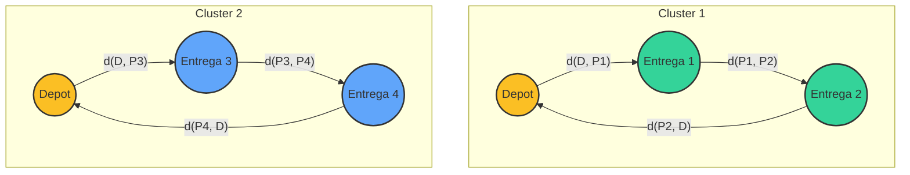

# Rota Inteligente: Otimização de Entregas com Algoritmos de IA

Este repositório contém a solução para o estudo de caso da disciplina *Artificial Intelligence Fundamentals*, focado na otimização de rotas de entrega para a empresa fictícia "Sabor Express" utilizando algoritmos de Inteligência Artificial.

---

## 📝 Descrição do Projeto

### O Problema
A "Sabor Express", uma pequena empresa de delivery de alimentos, enfrenta desafios logísticos significativos durante os horários de pico. O planejamento de rotas é feito manualmente, baseado na experiência dos entregadores, o que resulta em trajetos ineficientes, atrasos nas entregas, aumento dos custos com combustível e, consequentemente, na insatisfação dos clientes.

### O Desafio
O desafio consiste em desenvolver uma solução computacional que utilize técnicas de IA para automatizar e otimizar o processo de roteirização. A solução deve ser capaz de processar múltiplos pedidos simultaneamente e fornecer as rotas mais eficientes para cada entregador, visando minimizar a distância total percorrida e o tempo de entrega.

### Objetivos
*   **Principal:** Criar um sistema inteligente para otimizar as rotas de entrega.
*   **Específicos:**
    1.  Agrupar geograficamente os pontos de entrega para distribuí-los de forma equilibrada entre os entregadores.
    2.  Calcular a rota mais curta para cada grupo de entregas, tratando cada um como uma instância do Problema do Caixeiro Viajante (TSP).
    3.  Desenvolver uma interface visual interativa para simular e demonstrar a eficácia da solução.
    4.  Analisar a performance da abordagem e sugerir melhorias.

---

## 💡 Abordagem da Solução

A solução foi desenvolvida como uma aplicação web interativa que aborda o problema em duas fases principais, refletindo uma estratégia de "dividir para conquistar":

1.  **Fase 1: Agrupamento de Entregas (Clustering)**
    *   Primeiramente, os pedidos (representados como pontos em um mapa 2D) são agrupados em "zonas de entrega". Cada zona é atribuída a um entregador.
    *   Este processo de agrupamento é realizado pelo algoritmo **K-Means**, que particiona os pontos de dados em *k* clusters distintos, onde *k* é o número de entregadores disponíveis. O objetivo é minimizar a variância dentro de cada cluster, garantindo que os pedidos atribuídos a um entregador estejam geograficamente próximos.

2.  **Fase 2: Otimização da Rota (Roteamento)**
    *   Após a clusterização, o problema é simplificado: em vez de encontrar uma rota única e complexa para todos os pontos, calculamos uma rota otimizada para cada cluster de forma independente.
    *   Para cada entregador, determinamos a sequência ótima de visitas aos pontos de seu cluster, começando e terminando no depósito central. Este é um clássico Problema do Caixeiro Viajante (TSP).
    *   Para resolver o TSP, utilizamos a **Heurística do Vizinho Mais Próximo**. É um algoritmo guloso (greedy) que constrói a rota passo a passo, sempre se movendo para o ponto mais próximo ainda não visitado. Embora não garanta a rota ótima, oferece uma solução rápida e razoavelmente boa, adequada para uma aplicação em tempo real.

---

## 🤖 Algoritmos Utilizados

### K-Means (Aprendizado Não Supervisionado)
*   **Propósito:** Agrupar os pontos de entrega em *k* clusters, onde *k* é o número de entregadores.
*   **Funcionamento:** O algoritmo inicializa *k* centróides aleatoriamente. Em seguida, alterna entre duas etapas: (1) atribuir cada ponto ao centróide mais próximo e (2) recalcular cada centróide como a média dos pontos a ele atribuídos. Esse processo continua até que a posição dos centróides se estabilize.
*   **Justificativa:** Foi escolhido por sua simplicidade, eficiência computacional e eficácia em criar agrupamentos com base na proximidade espacial, o que é ideal para dividir as entregas em zonas geográficas coesas.

### Heurística do Vizinho Mais Próximo (Algoritmo Guloso)
*   **Propósito:** Encontrar uma solução aproximada para o Problema do Caixeiro Viajante (TSP) para cada cluster.
*   **Funcionamento:** A partir de um nó inicial (o depósito), o algoritmo visita iterativamente o nó mais próximo que ainda não foi visitado. O processo se repete até que todos os nós do cluster tenham sido visitados, e então a rota retorna ao depósito.
*   **Justificativa:** O TSP é um problema NP-difícil, e encontrar a solução ótima é computacionalmente inviável para um número moderado de pontos. A heurística do vizinho mais próximo oferece um excelente equilíbrio entre a qualidade da solução e a velocidade de execução, tornando-a ideal para este cenário.

---

## 📈 Diagrama do Grafo/Modelo

A cidade e os pontos de entrega são modelados como um **grafo completo não direcionado**, onde:

*   **Nós (Vértices):** Cada nó representa uma localização física:
    *   O depósito central.
    *   Cada um dos pontos de entrega.
*   **Arestas:** Uma aresta conecta cada par de nós no grafo.
*   **Pesos:** O peso de cada aresta corresponde à **distância euclidiana** (linha reta) entre os dois nós que ela conecta.

Este modelo simplifica o problema, permitindo que os algoritmos de clustering e roteirização operem sobre uma estrutura de dados bem definida.

*O diagrama acima ilustra conceitualmente o modelo: o depósito se conecta aos pontos de entrega, que são agrupados em clusters (rotas), formando um ciclo que retorna ao depósito.*

---

## 📊 Análise da Solução

### Resultados e Eficiência
A abordagem combinada de K-Means e Vizinho Mais Próximo demonstrou ser altamente eficaz. A aplicação consegue processar um grande número de pedidos e gerar rotas otimizadas em questão de segundos. Visualmente, a clusterização divide as entregas em regiões geográficas lógicas, e as rotas calculadas são visivelmente mais curtas e diretas do que seriam em um planejamento manual aleatório. A divisão do problema em subproblemas menores (um TSP por cluster) reduz drasticamente a complexidade computacional, tornando a solução escalável.

### Limitações
Apesar de sua eficácia, a solução possui algumas limitações inerentes aos modelos e algoritmos escolhidos:
1.  **Distância Euclidiana vs. Realidade:** O modelo utiliza a distância em linha reta, que não reflete as distâncias reais das ruas, trânsito, semáforos ou vias de mão única.
2.  **Ótimo Local do K-Means:** O K-Means pode convergir para um "ótimo local", significando que a clusterização pode não ser a melhor possível, dependendo da inicialização dos centróides.
3.  **Suboptimalidade do Vizinho Mais Próximo:** A heurística do vizinho mais próximo é gulosa e pode resultar em rotas que são até 25% mais longas que a rota ótima em certos casos.
4.  **Modelo Estático:** A solução não considera fatores dinâmicos como novos pedidos chegando em tempo real ou mudanças nas condições do trânsito.

### Sugestões de Melhoria
Para evoluir o projeto, as seguintes melhorias poderiam ser implementadas:
*   **Integração com APIs de Mapas:** Utilizar a API do Google Maps ou OpenStreetMap para obter distâncias e tempos de percurso reais, considerando a malha viária e o trânsito.
*   **Algoritmos de Roteirização Avançados:** Implementar heurísticas mais sofisticadas para o TSP, como **2-opt**, **Simulated Annealing** ou **Algoritmos Genéticos**, para encontrar rotas de melhor qualidade.
*   **Roteirização Dinâmica:** Desenvolver um sistema que possa recalcular rotas em tempo real para incorporar novos pedidos ou se adaptar a mudanças no trânsito.
*   **Restrições Adicionais:** Adicionar outras restrições do mundo real, como a capacidade de carga dos veículos dos entregadores e janelas de tempo para as entregas.
*   **Aprendizado por Reforço (RL):** Explorar o uso de RL para treinar um agente que aprenda a tomar decisões de roteirização ótimas com base na experiência, adaptando-se a padrões de demanda e tráfego ao longo do tempo.
